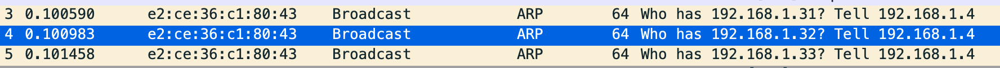

# ARPHomework
*author:Ross*

### homework content

> Open your browser on your computer, and enter one of your favorite websites such as "[github.com](http://github.com/)", what do you see about the network protocol? Try to capture the packets with Wireshark, and explain the whole process(which network protocols are involved and what the MAC/IP address represents)

### Answer:

- 从上图可知源mac为e2:ce:36:c1:80:43的主机发送了三个arp广播包询问ip为192.168.1.31, 192.168.1.32, 192.168.1.33的mac地址。

- 首先看报文内容可知这是一个两层协议，源机器希望目标机器填充原本用00:00:00:00:00:00占位的target mac，即希望目标机器能发送reply arp报文告知其mac地址。
- 其次可知arp广播时目的mac为FF:FF:FF:FF:FF:FF，即向交换机连接的所有机器发送广播包，从而问询目的mac地址。

- 由上图可知这是一个tcp three way handshake 建立连接过程
  - 源ip为192.168.1.8的机器先向目标ip为47.98.106.0的机器发送一个syn包
  - 然后ip为47.98.106.0的机器返回[syn,ack]
  - 源ip为192.168.1.8的机器再向目标ip为47.98.106.0的机器发送一个ack包
  - 从而建立tcp连接，两台主机可以进行数据交换

- 从上图http /get 请求可以看到：
  - response version为当前http的协议版本
  - status code 304表示资源没有发生过改变，即当前的内容从browser的cache中读取
  - server：nginx 即目标服务器由nginx进行代理
  - connection：keep-alive允许单个TCP 连接发送和接收多个HTTP 请求/响应，而不是为每个请求/响应对打开新连接
  - request uri：表明当前请求获取favicon.ico资源
